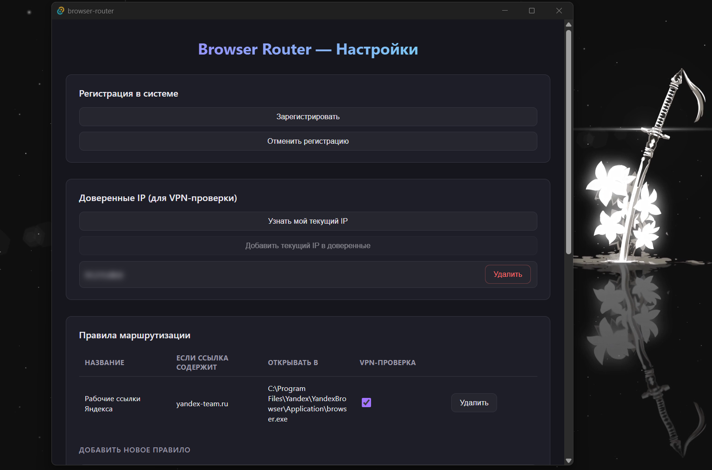
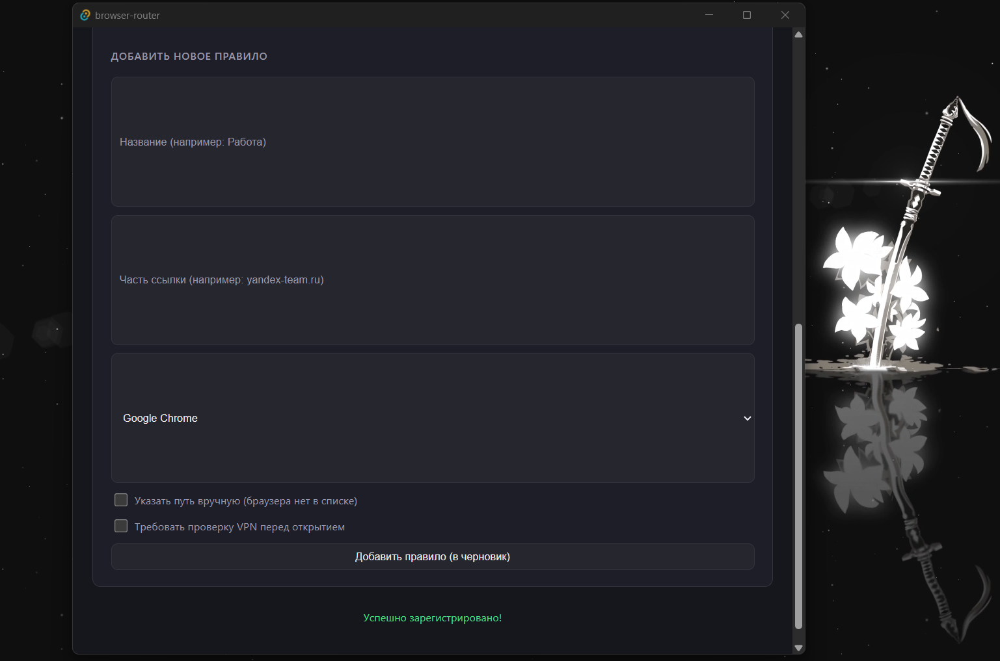

# Browser Router 🔀 — умный маршрутизатор ссылок между браузерами (Tauri + Rust + React)

## 🎯 Зачем эта программа вообще существует

Я работаю в Яндексе и параллельно пользуюсь двумя браузерами:
- **Chrome** — для личных дел и повседневного сёрфинга
- **Yandex Browser** — рабочий, специальный браузер для внутренних корпоративных сервисов

Раньше приходилось руками лезть в Параметры Windows и постоянно переключать браузер по умолчанию туда-обратно — неудобно и легко забыть.

Ещё более важная причина: **в рабочий браузер нельзя заходить через VPN** — если случайно откроешь внутреннюю ссылку с включённым VPN, можно словить проблемы от службы безопасности компании.

Эта программа решает обе проблемы разом:
- **Автоматически определяет**, куда должна открыться ссылка (по домену), и открывает её в нужном браузере — без ручного переключения
- **Проверяет, не включён ли VPN**, прежде чем открыть рабочую ссылку — сверяя твой текущий публичный IP со списком доверенных адресов, и если что-то не совпадает — честно спрашивает подтверждение, а не открывает вслепую

## 🖥️ Как это выглядит





## 🎥 VPN-проверка (The old one)

https://www.loom.com/share/6df2ba931f6f4b2ca273bdf8c11ad0fe

## ⚙️ Возможности

- 🔗 Гибкие правила маршрутизации: любое количество правил вида "если ссылка содержит X → открывать в браузере Y"
- 🖱️ Полноценный GUI для настройки — не нужно трогать код или JSON руками
- 🔍 Автоматический детект установленных браузеров (читает системный реестр Windows, как и стандартное окно "Выберите браузер по умолчанию")
- 🛡️ VPN-safety проверка по реальному IP, с авто-детектом (не спрашивает лишний раз, если IP уже в списке доверенных)
- 💾 Изменения применяются только по кнопке "Сохранить" — черновик не улетает в файл, пока сам не подтвердишь
- 🪶 Лёгкое (Tauri, а не Electron) — использует системный WebView, а не тащит с собой целый Chromium

## 🧠 Как это работает под капотом

Программа работает в двух режимах:

1. **CLI-режим** (когда Windows передаёт ей ссылку после клика) — тихо, без окна, решает по правилам, куда открыть ссылку, и завершается
2. **GUI-режим** (когда запускаешь программу напрямую, без аргументов) — открывается окно настроек

Регистрация в Windows как "браузер по умолчанию" делается через `HKEY_CURRENT_USER` в реестре (без прав администратора), так что программа появляется в списке кандидатов в Параметры → Приложения по умолчанию → Веб-браузер.

## 📦 Технологии

- **Backend:** Rust + Tauri 2
- **Frontend:** React + TypeScript
- **Реестр Windows:** `winreg`
- **HTTP-запросы (проверка IP):** `reqwest`
- **Системные диалоговые окна:** `rfd`
- **Конфиг:** `serde` + JSON, хранится в `%APPDATA%\BrowserRouter\config.json`

## 🚀 Установка и первый запуск

```bash
git clone https://github.com/S7ikeCat/browser-router.git
cd browser-router
npm install
npm run tauri build
```

Готовый `.exe` появится в `src-tauri\target\release\browser-router.exe`.

## 🛠 Как пользоваться (по шагам)

1. Запусти `browser-router.exe` (обычным двойным кликом) — откроется окно настроек
2. Настрой правила (домен → браузер), при желании включи VPN-проверку для нужных правил
3. Нажми **"Зарегистрировать"** — программа один раз пропишет себя в реестр Windows
4. Зайди в **Параметры Windows → Приложения → Приложения по умолчанию → Веб-браузер** → выбери **browser-router** для HTTP и HTTPS
5. Всё, дальше просто пользуешься — при клике по любой ссылке программа сама решит, в каком браузере её открыть

**Если решишь отменить:** открой программу → "Отменить регистрацию" — это уберёт её из списка браузеров и почистит реестр.

## 🔐 Как работает VPN-защита

Для правил с включённой VPN-проверкой:
1. Перед открытием программа узнаёт твой текущий публичный IP
2. Если IP есть в списке "доверенных" (тех, что ты сам добавил через кнопку в настройках) — ссылка открывается сразу, без вопросов
3. Если IP незнакомый (например, включён VPN) — появится предупреждение с возможностью проверить IP вручную и подтвердить/отменить открытие

Добавить свой обычный (домашний/рабочий) IP в доверенные можно через кнопку **"Узнать мой текущий IP" → "Добавить текущий IP в доверенные"** в настройках.

## ⚠️ Важные заметки

- Если переместишь `.exe` в другую папку — нужно заново нажать **"Зарегистрировать"** (реестр хранит конкретный путь к файлу)
- Домашний IP у провайдера может со временем меняться — если VPN-проверка вдруг начала появляться без причины, просто обнови доверенный IP той же кнопкой
- Конфиг лежит в `%APPDATA%\BrowserRouter\config.json` — переносится вместе с профилем Windows, но не с самим `.exe`

## ✅ Итог

Личный инструмент для удобного и безопасного переключения между личным и рабочим браузером — с автоматической маршрутизацией по ссылкам и защитой от случайного захода в корпоративные сервисы через VPN.